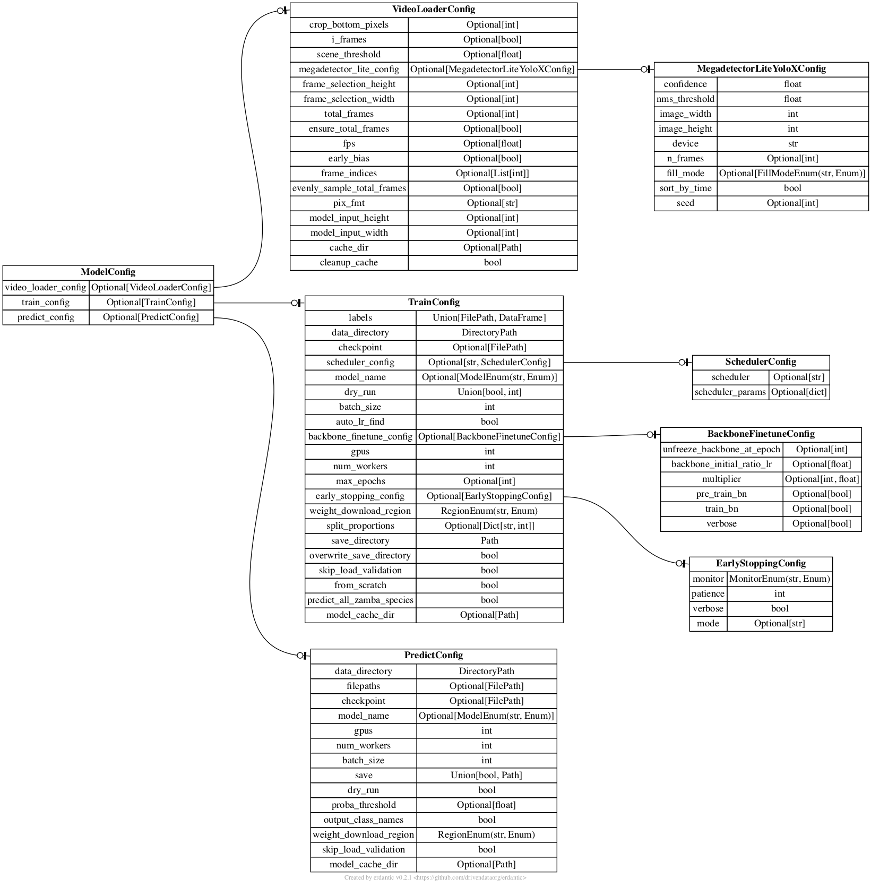

# All Optional Arguments

Three main configuration classes are specific in `zamba`:

* `VideoLoaderConfig`: Defines all possible parameters for how videos are loaded
* `PredictConfig`: Defines all possible parameters for model inference
* `TrainConfig`: Defines all possible parameters for model training

Here's a helpful diagram which shows how everything is related.



<a id='video-loading-arguments'></a>

## Video loading arguments

The `VideoLoaderConfig` class <!-- TODO: add link to source code><!--> defines all of the optional parameters that can be specified for how videos are loaded before either inference or training. This includes selecting which frames to use from each video.

```python
>> from zamba.data.video import VideoLoaderConfig
>> help(VideoLoaderConfig)

class VideoLoaderConfig(pydantic.main.BaseModel)
 |  VideoLoaderConfig(*, crop_bottom_pixels: int = None,
 i_frames: bool = False,
 scene_threshold: float = None,
 megadetector_lite_config: zamba.models.megadetector_lite_yolox.MegadetectorLiteYoloXConfig = None,
 video_height: int = None,
 video_width: int = None,
 total_frames: int = None,
 ensure_total_frames: bool = True,
 fps: float = None,
 early_bias: bool = False,
 frame_indices: List[int] = None,
 evenly_sample_total_frames: bool = False,
 pix_fmt: str = 'rgb24',
 resize_after_frame_selection: bool = False) -> None
```

Let's go through each of those arguments.

#### `crop_bottom_pixels (int, optional)`

Number of pixels to crop from the bottom of the video (prior to resizing to `video_height`). Defaults to `None`

#### `i_frames (bool, optional)`

Only load the [I-Frames](https://en.wikipedia.org/wiki/Video_compression_picture_types#Intra-coded_(I)_frames/slices_(key_frames)). Defaults to `False`

#### `scene_threshold (float, optional)`

Only load frames that correspond to [scene changes](http://www.ffmpeg.org/ffmpeg-filters.html#select_002c-aselect). Defaults to `None`

#### `megadetector_lite_config (MegadetectorLiteYoloXConfig, optional)`

The `megadetector_lite_config` is used to specify any parameters that should be passed to the [MegadetectorLiteYoloX model](models.md#megadetectorliteyolox) for frame selection. For all possible options, see the MegadetectorLiteYoloXConfig<!-- TODO: add github link><!-->. If `megadetector_lite_config` is `None` (the default), the MegadetectorLiteYoloX model will not be used to select frames.

#### `video_height (int, optional), video_width (int, optional)`

Resize the video to this height and width in pixels. Defaults to `None`

#### `total_frames (int, optional)`

Number of frames that should ultimately be returned. Defaults to `None`

#### `ensure_total_frames (bool)`

Selecting the number of frames by resampling may result in one more or fewer frames due to rounding. If True, ensure the requested number of frames is returned by either clipping or duplicating the final frame. Raises an error if no frames have been selected. Otherwise, return the array unchanged. Defaults to `True`

#### `fps (int, optional)`

Resample the video evenly from the entire duration to a specific number of frames per second. Defaults to `None`

#### `early_bias (bool, optional)`

Resamples to 24 fps and selects 16 frames biased toward the front. This strategy was used by the [Pri-matrix Factorization](https://www.drivendata.org/competitions/49/deep-learning-camera-trap-animals/) machine learning
competition winner. Defaults to `False`

#### `frame_indices (list(int), optional)`

Select specific frame numbers. Note: frame selection is done after any resampling. Defaults to `None`

#### `evenly_sample_total_frames (bool, optional)`

Reach the total number of frames specified by evenly sampling from the duration of the video. Defaults to `False`

#### `pix_fmt (str, optional)`

FFmpeg pixel format, defaults to `rgb24` for RGB channels; can be changed to `bgr24` for BGR.

<a id='prediction-arguments'></a>

## Prediction arguments

All possible model inference parameters are defined by the `PredictConfig` class<!-- TODO: add link to class definition on github><!-->. Let's see the class documentation in Python:

```python
>> from zamba.models.config import PredictConfig
>> help(PredictConfig)

class PredictConfig(ZambaBaseModel)
 |  PredictConfig(*, data_directory: pydantic.types.DirectoryPath = PosixPath('/home/ubuntu/zamba-algorithms'),
 filepaths: pydantic.types.FilePath = None,
 checkpoint: pydantic.types.FilePath = None,
 model_name: zamba.models.config.ModelEnum = <ModelEnum.time_distributed: 'time_distributed'>,
 species: List[str] = None,
 gpus: Union[List[int], str, int] = 1,
 num_workers: int = 7,
 batch_size: int = 8,
 save: Union[bool, pathlib.Path] = True,
 dry_run: bool = False,
 proba_threshold: float = None,
 output_class_names: bool = False,
 weight_download_region: zamba.models.utils.RegionEnum = 'us',
 cache_dir: pathlib.Path = None,
 skip_load_validation: bool = False) -> None

 ...
```

**Either `data_directory` or `filepaths` must be specified to instantiate `PredictConfig`.** Otherwise the current working directory will be used as the default `data_directory`.

#### `data_directory (DirectoryPath, optional)`

Path to the directory containing training videos. Defaults to the current working directory.

#### `filepaths (FilePath, optional)`

Path to a list of files for classification. Defaults to the files in the current working directory

#### `checkpoint (Path or str, optional)`

Path to a model checkpoint to load and use for inference. The default is `None`, which automatically loads the pretrained checkpoint for the model specified by `model_name`. Since the default `model_name` is `time_distributed` the default `checkpoint` is `zamba_time_distributed.ckpt`

#### `model_name (time_distributed|slowfast|european, optional)

Name of the model to use for inference. The three model options that ship with `zamba` are `time_distributed`, `slowfast`, and `european`. See the [Available Models](models.md) page for details. Defaults to `time_distributed`

#### `species (list(str), optional)`

List of possible species class labels for the data.  The default is `None`, which automatically loads the classes associated with the model specified by `model_name`. Since the default `model_name` is `time_distributed`, the default is the [32 species](models.md#species-classes) (plus blank) from central and west Africa.

#### `gpus (int, optional)`

The number of GPUs to use during inference. By default, all of the available GPUs found on the machine will be used. An error will be raised if the number of GPUs specified is more than the number that are available on the machine.

#### `num_workers (int, optional)`

The number of CPUs to use during training. By default, it will be set to either one less than the number of CPUs in the system, or one if there is only one CPU in the system.

#### `batch_size (int, optional)`

The batch size to use for inference. Defaults to `8`

#### `save (bool, optional)`

Whether to save out the predictions to a CSV file. y default, predictions will be saved at `zamba_predictions.csv` in the current working directory. Defaults to `True`

#### `dry_run (bool, optional)`

Specifying `True` is useful for trying out model implementations more quickly by running only a single batch of inference. Defaults to `False`

#### `proba_threshold (float between 0 and 1, optional)`

For advanced uses, you may want the algorithm to be more or less sensitive to if a species is present. This parameter is a `FLOAT` number, e.g., `0.64` corresponding to the probability threshold beyond which an animal is considered to be present in the video being analyzed.

By default no threshold is passed, `proba_threshold=None`. This will return a probability from 0-1 for each species that could occur in each video. If a threshold is passed, then the final prediction value returned for each class is `probability >= proba_threshold`, so that all class values become `0` (`False`, the species does not appear) or `1` (`True`, the species does appear).

#### `output_class_names (bool, optional)`

Setting this option to `True` yields the most concise output `zamba` is capable of. The highest species probability in a video is taken to be the _only_ species in that video, and the output returned is simply the video name and the name of the species with the highest class probability, or `blank` if the most likely classification is no animal. Defaults to `False`

#### `weight_download_region [us|eu|asia]`

Because `zamba` needs to download pretrained weights for the neural network architecture, we make these weights available in different regions. `us` is the default, but if you are not in the US you should use either `eu` for the European Union or `asia` for Asia Pacific to make sure that these download as quickly as possible for you.

#### `cache_dir (FilePath, optional)`

The directory where the model weights will be saved. If it is `None` (the default), the model will be cached to an automatic temp directory at `~/.cache/zamba`

#### `skip_load_validation (bool, optional)`

By default, before kicking off inference `zamba` will iterate through all of the videos in the data and verify that each can be loaded. Setting `skip_load_verification` to `True` skips this step. Validation can be very time intensive depending on the number of videos. It is recommended to run validation once, but not on future inference runs if the videos have not changed. Defaults to `False`

<a id='training-arguments'></a>

## Training arguments

All possible model training parameters are defined by the `TrainConfig` class<!-- TODO: add link to class definition><!-->. Let's see the class documentation in Python:

```python
>> from zamba.models.config import TrainConfig
>> help(TrainConfig)

class TrainConfig(ZambaBaseModel)
 |  TrainConfig(*, labels: Union[pydantic.types.FilePath, pandas.core.frame.DataFrame],
 data_directory: pydantic.types.DirectoryPath = PosixPath('/home/ubuntu/zamba-algorithms'),
 checkpoint: pydantic.types.FilePath = None,
 scheduler_config: Union[str, zamba.models.config.SchedulerConfig, NoneType] = 'default',
 model_name: zamba.models.config.ModelEnum = <ModelEnum.time_distributed: 'time_distributed'>,
 dry_run: Union[bool, int] = False,
 batch_size: int = 8,
 auto_lr_find: bool = True,
 backbone_finetune: bool = False,
 backbone_finetune_params: zamba.models.config.BackboneFinetuneConfig =
            BackboneFinetuneConfig(unfreeze_backbone_at_epoch=15,
            backbone_initial_ratio_lr=0.01, multiplier=1,
            pre_train_bn=False, train_bn=False, verbose=True),
 gpus: Union[List[int], str, int] = 1,
 num_workers: int = 7,
 max_epochs: int = None,
 early_stopping: bool = True,
 early_stopping_params: zamba.models.config.EarlyStoppingConfig =
            EarlyStoppingConfig(monitor='val_macro_f1', patience=3,
            verbose=True, mode='max'),
 tensorboard_log_dir: str = 'tensorboard_logs',
 weight_download_region: zamba.models.utils.RegionEnum = 'us',
 cache_dir: pathlib.Path = None,
 split_proportions: Dict[str, int] = {'train': 3, 'val': 1, 'holdout': 1},
 save_directory: pathlib.Path = None,
 skip_load_validation: bool = False,
 from_scratch: bool = False,
 predict_all_zamba_species: bool = True) -> None
 ...
```

**`data_directory` and `labels` must be specified to instantiate `TrainConfig`.** If no `data_directory` is provided, it will default the current working directory.

#### `labels (FilePath or pd.DataFrame, required)`

Either the path to a CSV file with labels for training, or a dataframe of the training labels. There must be columns for `filename` and `label`.

#### `data_directory (DirectoryPath, optional)`

Path to the directory containing training videos. Defaults to the current working directory.

#### `checkpoint (Path or str, optional)`

Path to a model checkpoint to load and resume training from. The default is `None`, which automatically loads the pretrained checkpoint for the model specified by `model_name`. Since the default `model_name` is `time_distributed` the default `checkpoint` is `zamba_time_distributed.ckpt`

#### `scheduler_config (zamba.models.config.SchedulerConfig, optional)`

A [PyTorch learning rate schedule](https://pytorch.org/docs/stable/optim.html#how-to-adjust-learning-rate) to adjust the learning rate based on the number of epochs. Scheduler can either be `default` (the default), `None`, or a [`torch.optim.lr_scheduler`](https://github.com/pytorch/pytorch/blob/master/torch/optim/lr_scheduler.py). If `default`,

#### `model_name (time_distributed|slowfast|european, optional)`

Name of the model to use for inference. The three model options that ship with `zamba` are `time_distributed`, `slowfast`, and `european`. See the [Available Models](models.md) page for details. Defaults to `time_distributed`

#### `dry_run (bool, optional)`

Specifying `True` is useful for trying out model implementations more quickly by running only a single batch of train and validation. Defaults to `False`

#### `batch_size (int, optional)`

The batch size to use for training. Defaults to `8`

#### `auto_lr_find (bool, optional)`

Whether to run a [learning rate finder algorithm](https://arxiv.org/abs/1506.01186) when calling `pytorch_lightning.trainer.tune()` to find the optimal initial learning rate. See the PyTorch Lightning [docs](https://pytorch-lightning.readthedocs.io/en/latest/common/trainer.html#auto-lr-find) for more details. Defaults to `True`

#### `backbone_finetune (bool, optional)`

Finetune a backbone model based on a learning rate user-defined scheduling. Derined from Pytorch Lightning's built-in `BackboneFinetuning`, but with the ability to freeze batch norm layers during the freeze phase. See `zamba.pytorch.finetuning` for details.<!-- TODO: add github link><!--> Defaults to `False`

#### `backbone_finetune_params (zamba.models.config.BackboneFinetuneConfig, optional)`

Parameters to pass to the `BackboneFinetuning` <!-- TODO: add link to github source code><!-->class if `backbone_finetune` is `True`. The default values are specified in the `BackboneFinetuneConfig` <!-- TODO: add link to github source code><!--> class: `BackboneFinetuneConfig(unfreeze_backbone_at_epoch=15, backbone_initial_ratio_lr=0.01, multiplier=1, pre_train_bn=False, train_bn=False, verbose=True)`

#### `gpus (int, optional)`

The number of GPUs to use during training. By default, all of the available GPUs found on the machine will be used. An error will be raised if the number of GPUs specified is more than the number that are available on the machine.

#### `num_workers (int, optional)`

The number of CPUs to use during training. By default, it will be set to either one less than the number of CPUs in the system, or one if there is only one CPU in the system.

#### `max_epochs (int, optional)`

The maximum number of epochs to run during training. Defaults to `None`

#### `early_stopping (bool, optional)`

Whether to monitor a metric during model training and stop training when the metric stops improving. Uses [`pytorch_lightning.callbacks.early_stopping`](https://pytorch-lightning.readthedocs.io/en/latest/common/early_stopping.html). Defaults to `True`

#### `early_stopping_params (zamba.models.config.EarlyStoppingConfig, optional)`

Parameters to pass to Pytorch lightning's [`EarlyStopping`](https://github.com/PyTorchLightning/pytorch-lightning/blob/c7451b3ccf742b0e8971332caf2e041ceabd9fe8/pytorch_lightning/callbacks/early_stopping.py#L35) if `early_stopping` is `True`. The default values are specified in the `EarlyStoppingConfig` <!-- TODO: add link to github source code><!--> class: `EarlyStoppingConfig(monitor='val_macro_f1', patience=3, verbose=True, mode='max')`

#### `tensorboard_log_dir (str, optional)`

Pytorch Lightning can log to a local file system in TensorBoard format with [TensorBoardLogger](https://pytorch-lightning.readthedocs.io/en/latest/api/pytorch_lightning.loggers.tensorboard.html). The directory in which to save these logs is set to `zamba/models/<tensorboard_log_dir>/`. Defaults to `tensorboard_logs`

#### `weight_download_region [us|eu|asia]`

Because `zamba` needs to download pretrained weights for the neural network architecture, we make these weights available in different regions. `us` is the default, but if you are not in the US you should use either `eu` for the European Union or `asia` for Asia Pacific to make sure that these download as quickly as possible for you.

#### `cache_dir (FilePath, optional)`

The directory where the trained model will be saved. If it is `None` (the default), the model will be cached to an automatic temp directory at `~/.cache/zamba`

#### `split_proportions (dict(str, int), optional)`

The proportion of data to use during training, validation, and as a holdout set. Defaults to `{"train": 3, "val": 1, "holdout": 1}`

#### `save_directory (Path, optional)`

Directory in which to save model checkpoint and configuration file. If not specified, will save to a folder called 'zamba_{model_name}' in your working directory.

#### `skip_load_validation (bool, optional)`

By default, before kicking off training `zamba` will iterate through all of the videos in the training data and verify that each can be loaded. Setting `skip_load_verification` to `True` skips this step. Validation can be very time intensive depending on the number of videos. It is recommended to run validation once, but not on future training runs if the videos have not changed. Defaults to `False`

#### `from_scratch (bool, optional)`

Whether to instantiate the model with base weights. This means starting from the imagenet weights for image based models and the Kinetics weights for video models. Only used if labels is not None. Defaults to `False`

#### `predict_all_zamba_species (bool, optional)`

Whether the species outputted by the model should be all zamba species. If you want the model classes to only be the species in your labels file, set to `False`. Only used if labels is not `None`. If either `predict_all_zamba_species` is `False` or the labels contain species that are not in the model, the model head will be replaced. Defaults to `True`.
