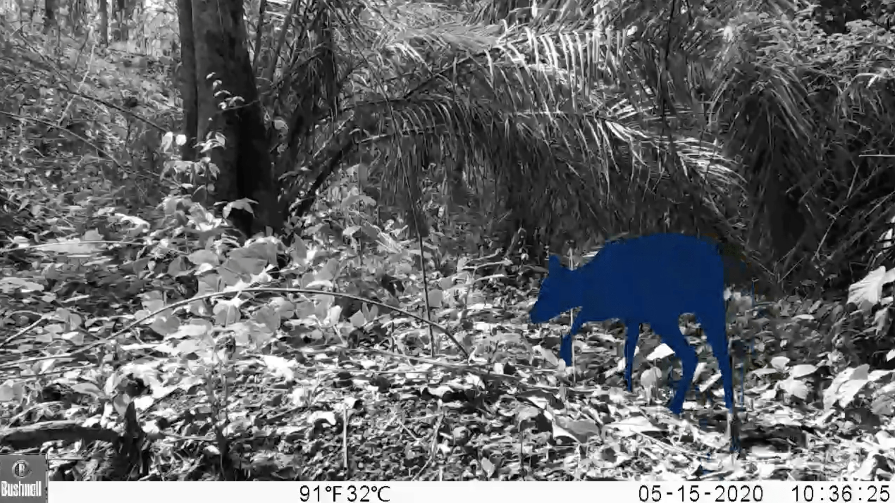
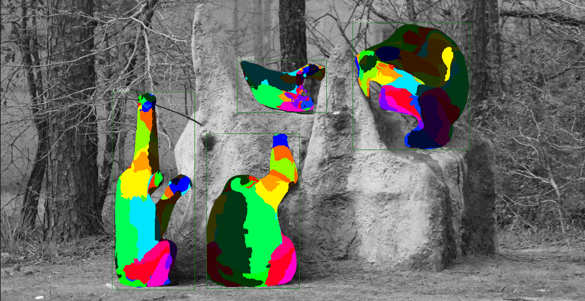

# DensePose

## Background

DensePose ([Neverova et al, 2021](https://arxiv.org/abs/2011.12438v1)) is a model published by Facebook AI Research that can be used to get segmentations for animals that appear in videos. The model was trained on the following animals, but often works for other species as well: bear, cat, cow, dog, elephant, giraffe, horse, sheep, zebra. Here's an example of the segmentation output for a frame:



Additionally, the model provides mapping of the segmentation output to specific anatomy for chimpanzees. This can be helpful for determining the orientation of chimpanzees in videos and for understanding their behaviors. Here is an example of what that output looks like:



For more information on the algorithms and outputs of the DensePose model, see the [Facebook DensePose Github Repository](https://github.com/facebookresearch/detectron2/tree/main/projects/DensePose).

## Outputs

The Zamba package supports running DensePose on videos to generate three types of outputs:

 - A `.json` file with details of segmentations per video frame.
 - A `.mp4` file where the original video has the segmentation rendered on top of animal so that the output can be visually inspected.
 - A `.csv` that contains the height and width of the bounding box around each chimpanzee, the frame number and timestamp of the observation, and the percentage of pixels in the bounding box that correspond with each anatomical part. This is specified by adding `--output-type chimp_anatomy`.

Running the DensePose model is fairly computationally intensive. It is recommended to run the model at a relatively low framerate (e.g., 1 frame per second) to generate outputs for a video. JSON output files can also be quite large because they contain the full embedding. These are not written out by default.

## Installation

In order to use the DensePose model, you must have [PyTorch](https://pytorch.org/get-started/locally/) already installed on your system. Then you must install the `densepose` extra:

```bash
pip install torch
pip install "https://github.com/drivendataorg/zamba/releases/latest/download/zamba.tar.gz#egg=zamba[densepose]"
```

## Running DensePose

Once that is done, here's how to run the DensePose model:

=== "CLI"
    ```bash
    # create a segmentation output video for each input video in PATH_TO_VIDEOS
    zamba densepose --data-dir PATH_TO_VIDEOS --render-output
    ```
=== "Python"
    ```python
    from zamba.models.densepose import DensePoseConfig
    densepose_conf = DensePoseConfig(data_dir="PATH_TO_VIDEOS", render_output=True)
    densepose_conf.run_model()
    ```

<video controls>
  <source src="../../media/densepose_zamba_vid.mp4" type="video/mp4">
</video>


## Getting help

To see all of the available options, run `zamba densepose --help`.

```console
$ zamba densepose --help
Usage: zamba densepose [OPTIONS]

  Run densepose algorithm on videos.

  If an argument is specified in both the command line and in a yaml file, the
  command line input will take precedence.

Options:
  --data-dir PATH                 Path to video or image file or folder
                                  containing images/videos.
  --filepaths PATH                Path to csv containing `filepath` column
                                  with videos.
  --save-dir PATH                 An optional directory for saving the output.
                                  Defaults to the current working directory.
  --config PATH                   Specify options using yaml configuration
                                  file instead of through command line
                                  options.
  --fps FLOAT                     Number of frames per second to process.
                                  Defaults to 1.0 (1 frame per second).
                                  [default: 1.0]
  --output-type [segmentation|chimp_anatomy]
                                  If 'chimp_anatomy' will apply anatomy model
                                  from densepose to the rendering and create a
                                  CSV with the anatomy visible in each frame.
                                  If 'segmentation', will just output the
                                  segmented area where an animal is
                                  identified, which works for more species
                                  than chimpanzees.  [default: chimp_anatomy]
  --render-output / --no-render-output
                                  If True, generate an output image or video
                                  with either the segmentation or anatomy
                                  rendered depending on the `output_type` that
                                  is chosen.  [default: no-render-output]
  --weight-download-region [us|eu|asia]
                                  Server region for downloading weights.
  --cache-dir PATH                Path to directory for model weights.
                                  Alternatively, specify with environment
                                  variable `ZAMBA_CACHE_DIR`. If not
                                  specified, user's cache directory is used.
  -y, --yes                       Skip confirmation of configuration and
                                  proceed right to prediction.
  --help                          Show this message and exit.
```
