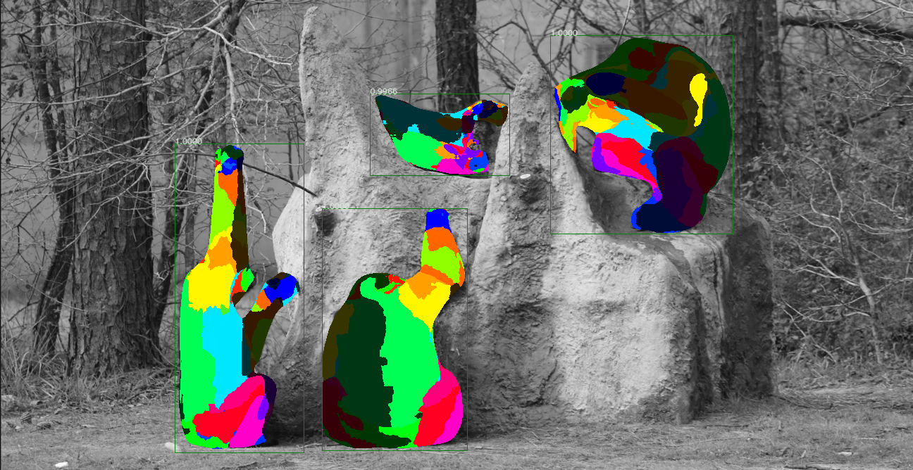

# Densepose

## Background

Facebook AI Research has published a model, DensePose ([Neverova et al, 2021](https://arxiv.org/abs/2011.12438v1)), which can be used to get segmentations for animals that appear in videos. This was trained on the following animals, but often works for other species as well: sheep, zebra, horse, giraffe, elephant, cow, ear, cat, dog. Here's an example of the segmentation output for a frame:


Additionally, the model provides mapping of the segmentation output to specific anatomy for chimpanzees. This can be helpful for determining the orientation of chimpanzees in videos and for their behaviors. Here is an example of what that output looks like:



For more information on the algorithms and outputs of the DensePose model, see the [Facebook DensePose Github Repository](https://github.com/facebookresearch/detectron2/tree/main/projects/DensePose).

## Outputs

The Zamba package supports running Densepose on videos to generate three types of outputs:

 - A `.json` file with details of segmentations per video frame.
 - A `.mp4` file where the original video has the segmentation rendered on top of animal so that the output can be vsiually inspected.
 - A `.csv` (when `--output-type chimp_anatomy`) that contains the height and width of the bounding box around each chimpanzee, the frame number and timestamp of the observation, and the percentage of pixels in the bounding box that correspond with each anatomical part.

Generally, running the densepose model is computationally intensive. It is recommended to run the model at a relatively low framerate (e.g., 1 frame per second) to generate outputs for a video. Another caveat is that because the output JSON output contains the full embedding, these files can be quite large. These are not written out by default.

In order to use the densepose model, you must have PyTorch already installed on your system, and then you must install the `densepose` extra:

```bash
pip install torch  # see https://pytorch.org/get-started/locally/
pip install "zamba[densepose]"
```

## Running DensePose

Once that is done, here's how to run the DensePose model:

=== "CLI"
    ```bash
    # create a segmentation output video for each input video in PATH_TO_VIDEOS
    zamba densepose --data-dir PATH_TO_VIDEOS --render-output
    ```
=== "Python"
    ```python
    from zamba.models.densepose import DensePoseConfig
    densepose_conf = DensePoseConfig(data_directory="PATH_TO_VIDEOS", render_output=True)
    densepose_conf.run_model()
    ```


<video controls>
  <source src="../media/densepose_zamba_vid.mp4" type="video/mp4">
</videp>

To see all of the available options, run `zamba densepose --help`.
